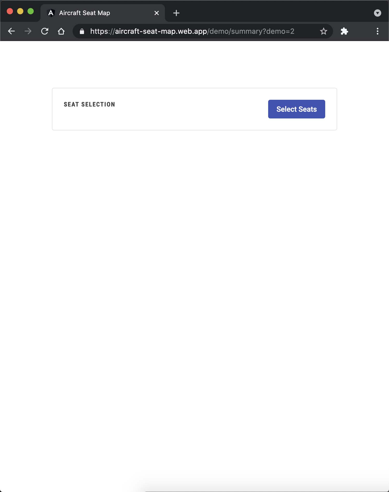
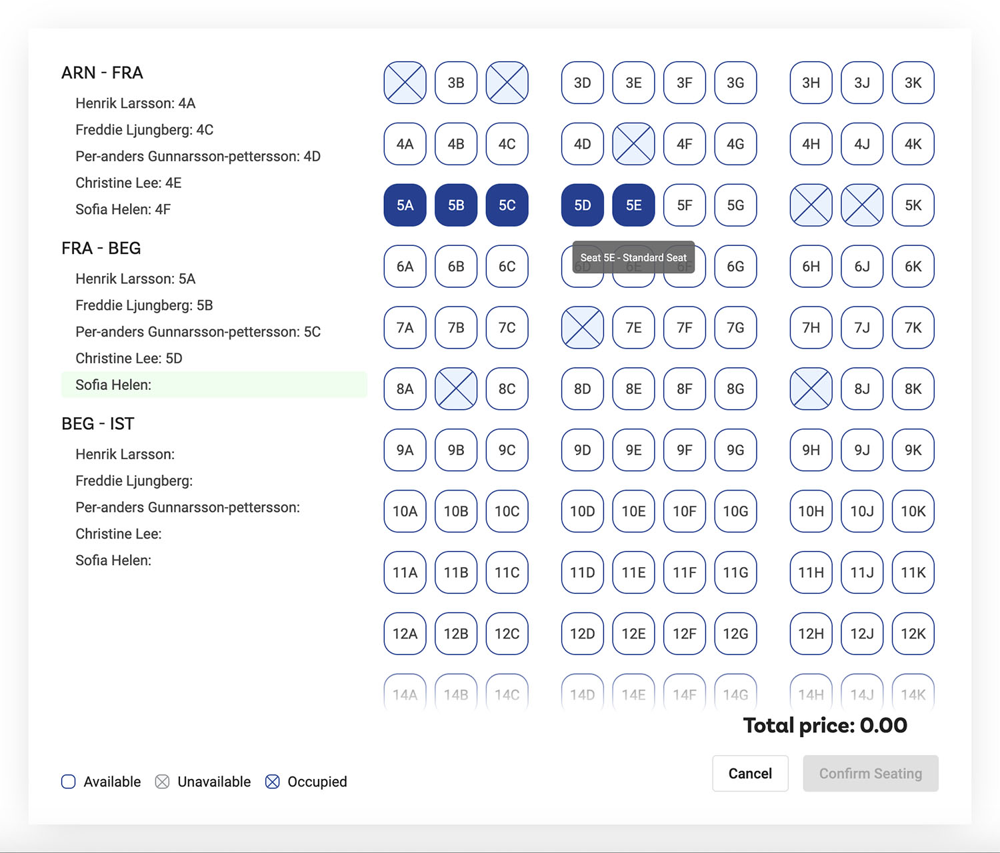
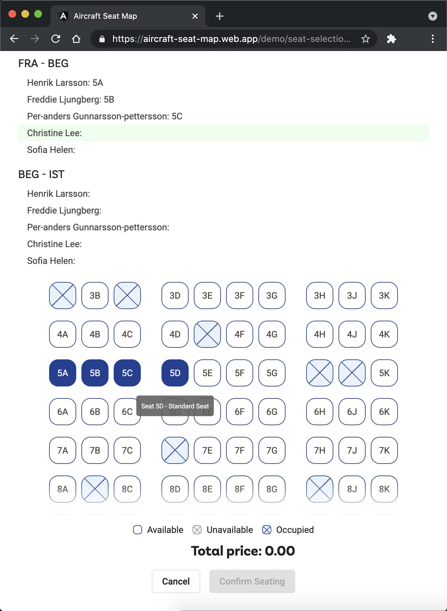
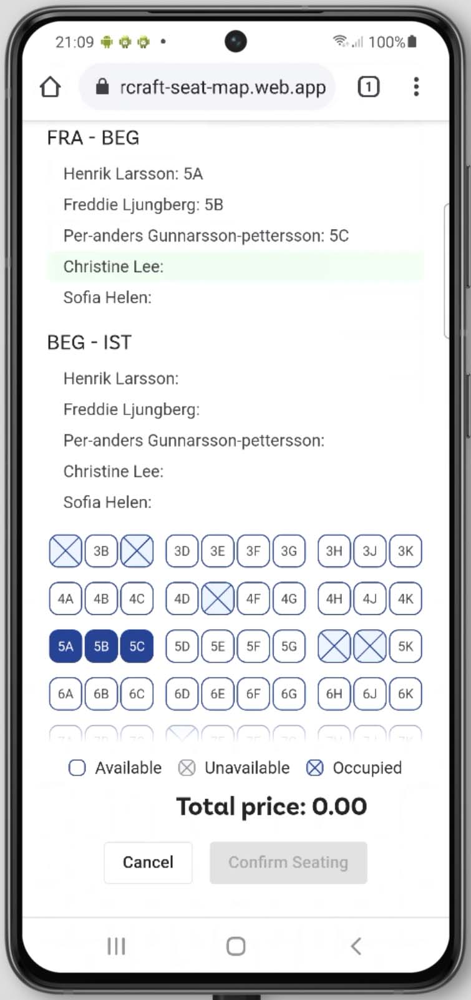
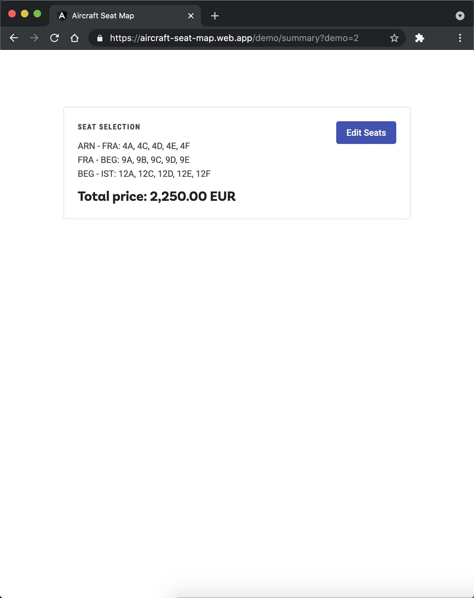

# Aircraft Seat Map (Prototyping App)

This project was generated with [Angular CLI](https://github.com/angular/angular-cli) version 10.2.2.

## Demo Notes

### Steps

1. Seat Selection box with Select Seats button
2. Middle steps including:
   - Aircraft Seat Map
   - Pre-selected first passenger in first flight
   - Select passenger seat for each flight
   - Auto-select next passenger
   - Tooltip with seat details
   - Dynamic passengers list height (depends on number of passengers)
   - Update seat selection before confirmation
   - Seat selection validation (all seats must be selected in the initial version)
   - Total price will be calculated with valid data
3. Seat Selection box with summary details and Edit Seats button

### API Data Structure

[API Data Structure](src/aircraft-seat-map/shared/models/flight-seat-map-api-response.ts)

### Demo Example Screens

First Step Screen

Middle Step, Medium+ Screen (924px+)

Middle Step, Small Screen (612px-923px)

Middle Step, Extra Small Screen (360px-611px)

Last Step Screen

#### Different Example URLs

- https://aircraft-seat-map.web.app/demo/summary?demo=1 (2 flights, 2 passengers, 2+2 and 3+3 seating layout, no priced seat offers)
- https://aircraft-seat-map.web.app/demo/summary?demo=2 (3 flights, 5 passengers, 2+3+2 and 3+4+3 max seating layout, no priced seat offers)
- https://aircraft-seat-map.web.app/demo/summary?demo=3 (1 flight, 2 passengers, 2+2 seating layout, no priced seat offers)
- https://aircraft-seat-map.web.app/demo/summary?demo=4 (4 flights, 2 passengers, 2+2 and 3+3 seating layout, with priced seat offers; note: 1st row in 1st flight have different prices for each seat)
- https://aircraft-seat-map.web.app/demo/summary?demo=5 (additional examples, with priced seat offers)

## The biggest aircraft's (additional note for discussion)

- **Airbus A380-800** (853 passengers; 3+4+3 seating layout)
- **Boeing 777-300** (550/368 passengers; 2+3+2 seating layout)
- **Boeing 747-400** (524/416 passengers; 3+4+3 seating layout)
- **Airbus A340-600** (475/380 passengers; 2+4+2 seating layout)
- **Boeing 747-8 Intercontinental** (467 passengers; 3+4+3 seating layout)

## Development server

Run `ng serve` for a dev server. Navigate to `http://localhost:4200/`. The app will automatically reload if you change any of the source files.

## Code scaffolding

Run `ng generate component component-name` to generate a new component. You can also use `ng generate directive|pipe|service|class|guard|interface|enum|module`.

## Build

Run `ng build` to build the project. The build artifacts will be stored in the `dist/` directory. Use the `--prod` flag for a production build.

## Running unit tests

Run `ng test` to execute the unit tests via [Karma](https://karma-runner.github.io).

## Running end-to-end tests

Run `ng e2e` to execute the end-to-end tests via [Protractor](http://www.protractortest.org/).

## Further help

To get more help on the Angular CLI use `ng help` or go check out the [Angular CLI Overview and Command Reference](https://angular.io/cli) page.
