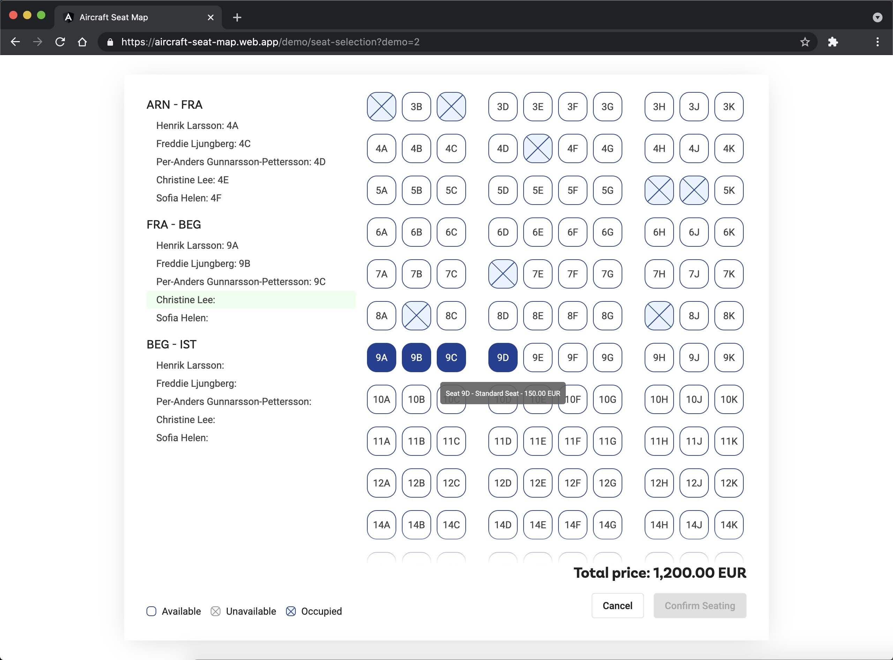
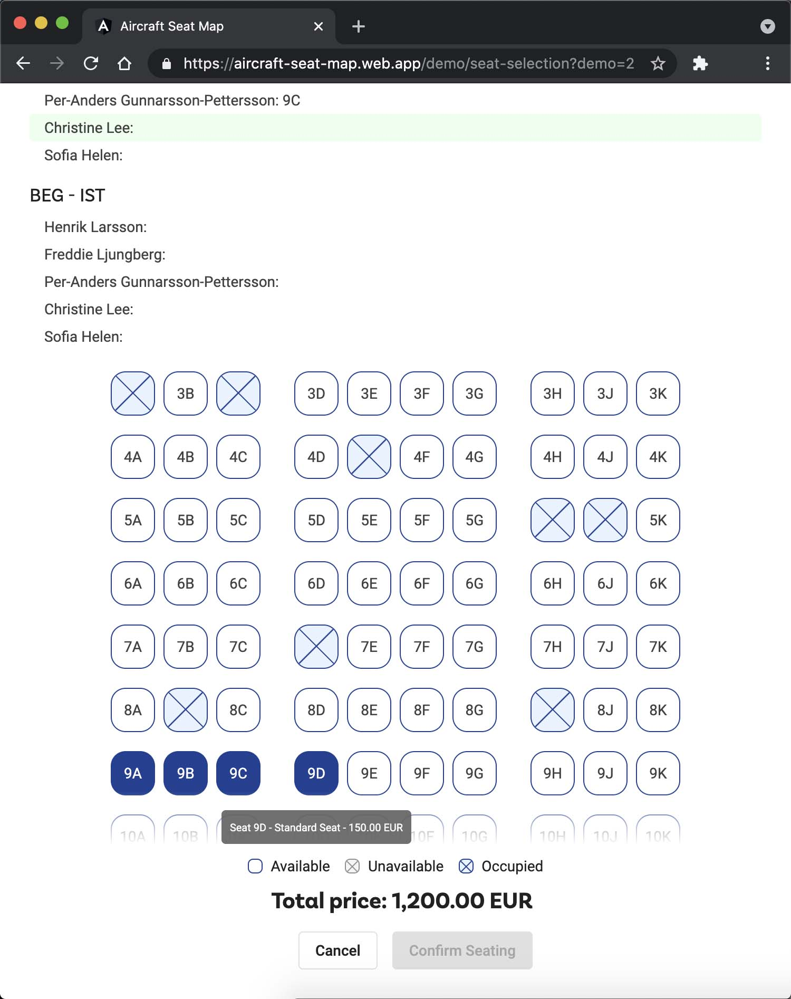
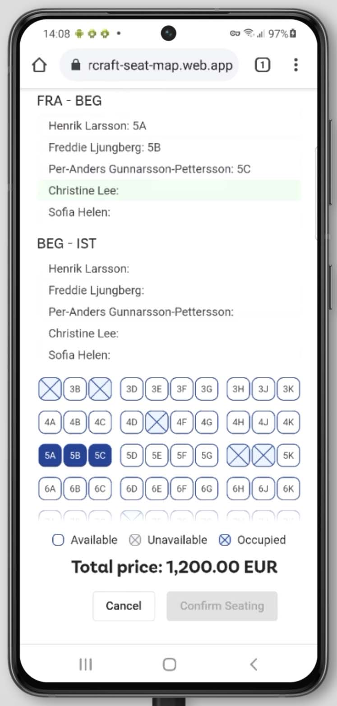

# Aircraft Seat Map

This project was generated with [Angular CLI](https://github.com/angular/angular-cli) version 10.2.2.

## Demo Notes

### Steps

1. **Seat Selection** with **Select seat** button section
2. All middle userSelectionSteps including **seat map**, **select flight** and **select traveler** dropdowns, **current selection**, and **seat selection**
3. **Selected seats** with **Edit seats** section

### API Data Structure

[API Data Structure](src/aircraft-seat-map/shared/models/flight-seat-map-api-response.ts)

### Demo Example

Medium+ Screen

Small Screen

Extra Small Screen

#### Different Examples

- https://aircraft-seat-map.web.app/demo/summary?demo=1 (2 flights, 2 passengers, 2+2 and 3+3 seating layout, no priced seat offers)
- https://aircraft-seat-map.web.app/demo/summary?demo=2 (3 flights, 3 passengers, 2+3+2 and 3+4+3 seating layout, no priced seat offers)
- https://aircraft-seat-map.web.app/demo/summary?demo=3 (1 flight, 2 passengers, 2+2 seating layout, no priced seat offers)
- https://aircraft-seat-map.web.app/demo/summary?demo=4 (4 flights, 2 passengers, 2+2 and 3+3 seating layout, with priced seat offers; note: 1st row in 1st flight have different prices for each seat)
- https://aircraft-seat-map.web.app/demo/summary?demo=5 (additional examples, with priced seat offers)

## The biggest aircraft

- **Airbus A380-800** (853 passengers; 3+4+3 seating layout)
- **Boeing 777-300** (550/368 passengers; 2+3+2 seating layout)
- **Boeing 747-400** (524/416 passengers; 3+4+3 seating layout)
- **Airbus A340-600** (475/380 passengers; 2+4+2 seating layout)
- **Boeing 747-8 Intercontinental** (467 passengers; 3+4+3 seating layout)

## Development server

Run `ng serve` for a dev server. Navigate to `http://localhost:4200/`. The app will automatically reload if you change any of the source files.

## Code scaffolding

Run `ng generate component component-name` to generate a new component. You can also use `ng generate directive|pipe|service|class|guard|interface|enum|module`.

## Build

Run `ng build` to build the project. The build artifacts will be stored in the `dist/` directory. Use the `--prod` flag for a production build.

## Running unit tests

Run `ng test` to execute the unit tests via [Karma](https://karma-runner.github.io).

## Running end-to-end tests

Run `ng e2e` to execute the end-to-end tests via [Protractor](http://www.protractortest.org/).

## Further help

To get more help on the Angular CLI use `ng help` or go check out the [Angular CLI Overview and Command Reference](https://angular.io/cli) page.
